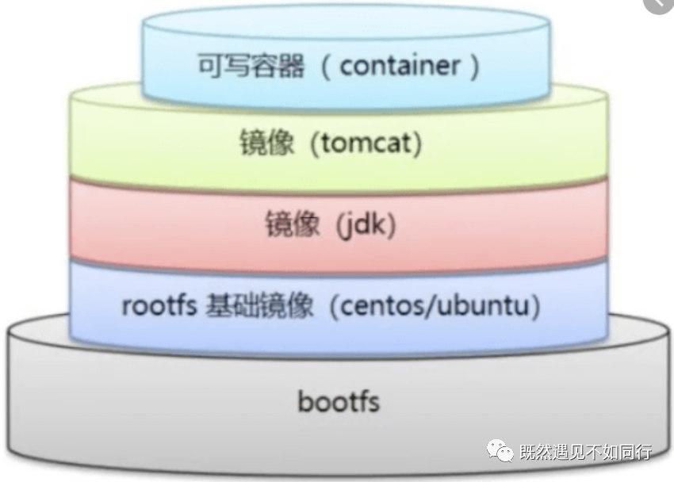
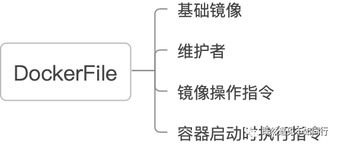
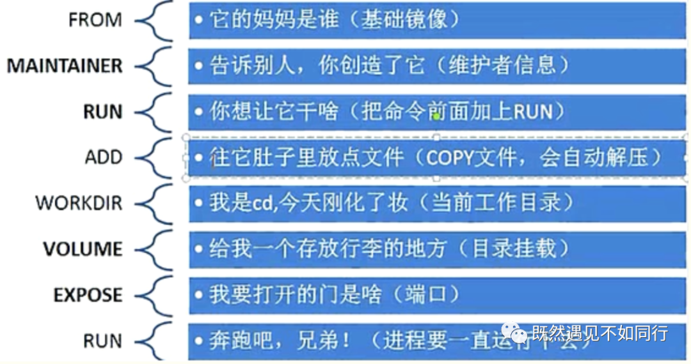

# 什么是Docker
    Docker是一种容器化的技术，包括一个命令行程序、一个后台守护进程以及一组远程服务
  * 镜像（Image）
  * 容器（Container） 
  * 仓库（Repository）
  

    
    
## 基础命令
    docker info  获取docker系统配置的信息;
    docker version 获取docker版本;
    docker help  获取docker帮助文档;
## 镜像命令
    docker images 查看镜像相关的信息:

        -a 查看所有镜像;

        -q 查看容器id;

    docker search 搜索容器信息

        -filter=STARS=3000 关注度大于300以上的;

    docker pull 下载镜像，采用分层下载，采用联合文件系统，默认是新的版本的

    dcoker pull mysql:5.7  dcoker pull 镜像名称:版本号(Tag);

    docker rmi 删除镜像

    docker rmi -f 镜像ID

    docker rmi -f $(docker iamges -aq) 删除全部的镜像id

    docker push mysql:5.7 推送镜像

## 容器命令
    docker run 是Docker中最为核心的一个命令，用于新建并启动容器

        -name="名称"  容器名称;

        -d  使用后台交互的方式;

        -it  使用交互方式，进入到容器内部;

        -p  用于将容器的端口暴露给宿主机的端口，格式为：hostPort:containerPort ，通过端口的暴露，可以让外部主机能够访问容器内的应用;

        -P  随机指定端口;

        -c 用于给运行在容器中的所有进程分配 CPU 的 shares 值，这是一个相对权重，实际的处理速度与宿主机的 CPU 相关

        -m 用于限制为容器中所有进程分配的内存总量，以 B、K、M、G 为单位；

    docker ps 列出正在运行的容器

        -a 列出当前正在运行的容器和历史运行过的容器;

        -n=? 显示最近创建的容器;

        -q 只显示容器的编号;

    docker build  使用Dockerfile创建镜像。
    
        
    进入正在运行的容器

        docker exec -it 容器id；

        docker attach 容器Id；

    退出容器

        exit 容器停止并退出;

        Ctrl + P + Q 容器停止并退出;

    删除容器

        docker rm  容器id删除指定的容器，不能删除正在运行的容器;

        docker ps -a -q | xargs docker rm 删除所有的容器;

    启动和停止容器的操作

        docker start 容器id         启动容器;

        docker restart 容器id      重启容器;

        docker stop 容器id         停止容器;

        docker kill 容器ID           强杀容器;

    docker logs 查看docker logs的日志

        --details 显示日志详情；

        -f  跟随日志输出显示；

        --tail 从末尾开始显示指定行的数据；

        -t 显示时间戳；

        --since 开始时间；

        --until 结束时间；

    docker top 查看容器的进程信息

    docker inspect 查看镜像的元数据

# DockerFile
  >   Dockfile是一种被Docker程序解释的脚本，Dockerfile由一条一条
        的指令组成，每条指令对应Linux下面的一条命令。 Docker程序将这些Dockerfile指令翻译真正的Linux命令。Dockerfile有自己书写格式和支持的命令，Docker程序解决这些命令间的依赖关系。  Docker程序将读取Dockerfile，根据指令生成定制的镜像(Image)。相比镜像这种黑盒子，Dockerfile这种显而易见的脚本更容易被使用者接受，它明确镜像是怎么产生的。 有了Dockerfile，当我们需要定制自己额外的需求时，只需在Dockerfile上添加或者修改指令，重新生成镜像即可，省去了敲命令的麻烦，每次增加一条命令就相当于在镜像的基础增加一层。

   

# Dockerfile指令介绍
 * FROM（指定基础镜像）
    > 指定基础镜像，必须为第一个命令；后续的指令都依赖于该指令 指定的镜像。FROM指令指定的基础镜像可以是官方远程仓库中的，也可以位于本地仓库。

        #使用
        FROM <image>
        FROM <image>:<tag>
        #demo
        FROM mysql:5.7
        #解释 tag是可选的，如果不使用这两个值时，会使用latest版本的基础镜像
 * MAINTAINER（用来指定镜像创建者信息）
   > 构建指令，用于将镜像制作者相关的信息写入到镜像中。 当我们对该镜像执行docker inspect命令时，输出中有相应的字段记录该信息。

        #使用
        MAINTAINER <name>
        #demo
        MAINTAINER wtz wtz@163.com
* RUN（构建镜像时执行的命令）
  > RUN用于在镜像容器中执行命令，其有以下两种命令执行方式：

        #shell执行方式
        #使用
        RUN <command>
        #demo
        RUN yum install wget
        RUN wget -O redis.tar.gz "http://download.redis.io/releases/redis-5.0.3.tar.gz"
        RUN tar -xvf redis.tar.gz 
        #exec执行方式
        #使用
        RUN ["executable", "param1", "param2"]
        #demo
        RUN ["/etc/execfile", "arg1", "arg1"]
        #备注
        RUN指令创建的中间镜像会被缓存，并会在下次构建中使用。如果不想使用这些缓存镜像，可以在构建时指定--no-cache参数，如：docker build --no-cache
* ADD（添加文件）
   > 将本地文件添加到容器中，tar类型文件会自动解压(网络压缩资源不会被解压)， 可以访问网络资源，类似wget；

        #使用
        ADD <src>... <dest>
        ADD ["<src>",... "<dest>"] 用于支持包含空格的路径
        #demo
        ADD test.txt /test/    #添加test文件到 /test/
* COPY（拷贝文件）
    > 拷贝文件，不会自动解压文件，也不能访问网络资源；

* CMD（构建容器后调用）
   > 指定启动容器时执行的命令，每个 Dockerfile 只能有一条 CMD 命令。如果指定了多条命令， 只有最后一条会被执行。如果用户启动容器时候指定了运行的命令，则会覆盖掉 CMD 指定的命令。后面这两点一定要注意，我做了一些对应的demo，大家可以参考一下。

        #支持三种格式:
        #使用exec执行，推荐方式；
        CMD ["executable","param1","param2"]
        #在/bin/sh中执行，提供给需要交互的应用；
        CMD command param1 param2
        #提供给ENTRYPOINT的默认参数；
        CMD ["param1","param2"] 
* ENTRYPOINT（构建容器后调用）
   > 类似于CMD指令，配置容器启动后执行的命令，并且不被docker run提供的参数覆盖。
    每个 Dockerfile 中只能有一个 ENTRYPOINT，当指定多个时，只有最后一个起效。
    可以搭配CMD命令使用：变参会使用CMD ，这里的CMD等于是在给ENTRYPOINT传参。

        #支持两种格式
        #使用exec执行
        ENTRYPOINT ["executable", "param1", "param2"]
        #shell中执行
        ENTRYPOINT command param1 param2
* ENV（设置环境变量）
    > 设置环境变量，定义了环境变量，那么在后续的指令中，就可以使用这个环境变量。容器启动后，可以通过docker inspect查看这个环境变量，也可以通过在docker run --env key=value时设置或修改环境变量

        #使用
        ENV <key> <value>
* EXPOSE（指定于外界交互的端口）
   > 设置指令，该指令会将容器中的端口映射成宿主机器中的某个端口。当你需要访问容器的时候，可以不是用容器的IP地址而是使用宿主机器的IP地址和映射后的端口。要完成整个操作需要两个步骤，首先在Dockerfile使用EXPOSE设置需要映射的容器端口，然后在运行容器的时候指定-p选项加上EXPOSE设置的端口，这样EXPOSE设置的端口号会被随机映射成宿主机器中的一个端口号。也可以指定需要映射到宿主机器的那个端口，这时要确保宿主机器上的端口号没有被使用。EXPOSE指令可以一次设置多个端口号，相应的运行容器的时候，可以配套的多次使用-p选项。

        #使用
        EXPOSE <port> [<port>...]
* VOLUME（指定持久化的目录）
    > 创建一个可以从本地主机或其他容器挂载的挂载点，一般用来存放需要持久化的数据。Volume设置指令，使容器中的一个目录具有持久化存储数据的功能，该目录可以被容器本身使用，也可以共享给其他容器使用;

        #使用
        VOLUME ["<mountpoint>"]
* WORKDIR（切换目录）
    > 设置指令，可以多次切换(相当于cd命令);

        #格式
        WORKDIR /path/to/workdir
* USER（指定用户）
    > 指定运行容器时的用户名或UID，默认是root，后续的RUN也会使用指定用户。使用USER指定用户时，可以使用用户名、UID或GID，或是两者的组合。当服务不需要管理员权限时，可以通过该命令指定运行用户。并且可以在之前创建所需要的用户;

        #使用
        USER user
        USER user:group
        USER uid
        USER uid:gid
        USER user:gid
        USER uid:group

    
# k8s
>    容器编排

  * docker swarm  
  * k8s
> 概念
 * Pod
  
        应用服务所在容器的封装,pod内容器网络共享,共享存储
    * replication controller

            旧一代pod启动方式,保证副本数,服务无人值守,k8s会时刻保证指定数量的pod运行,一定的回滚能力
    * Replica sets / Deployment
  
            新一代方式,更复杂的匹配模式,更多功能,更强的回滚能力 deployment是rs的超集，社区高速更新deployment，所以未来只需考虑deployment方式
    * Statefulset
  
            一般的服务无需唯一的标示,但是像集群化部署的服务,比如etcd,zoomkeeper,elasticsearch,服务启动后，服务所对应的名称或其他信息是其用来加入集群的唯一标识，这种服务就需要statefulset启动,一般需要搭载持久化数据卷
    * Deamon set

            守护进程式pod,保证集群每个节点都运行一个pod,比如要对集群每个节点进行cpu,内存等资源监控，就可以启用deamon set
* Service

        因为pod对于k8s来讲，常态下是随时关闭重建的，比如上面的各种pod运行模式，当你调整pod数量时，k8s就会扩缩pod，这个时候,调用端不知道pod发生了什么变化，所以需要引入service,容器服务通过service暴露出去,service相当于pod的负载均衡器，调用服务一方只需要将请求发至service,service会将请求分发至正常运行状态下的pod

    * CluserIP(默认)

            通过iptables做nat规则转换，将流量转到相应的pod内,一般用于集群内部服务之间访问

    * NodePort

            暴露主机随机端口,kube-proxy相应规则写入iptables表，访问主机端口将会被引流至相应的pod

    * LoadBalancer

            NodePort的变种，一般由具体的云服务商实现，比如阿里云，一旦service创建后,会自动创建一个负载均衡，会自动做80:3xxxx端口的映射，那么流量通过负载均衡，会转到相应主机端口，最终根据iptables规则 将流量转发到pod内
* Ingress

        一般暴露到外部的服务，都采取LoadBalancer方式，如果开放的服务越多，势必造成前端负载均衡器过多，资源浪费，且管理不易，所以k8s社区提供了ingress方案，作为7层http负载，作用相当于反向代理的nginx的服务，流量通过一台负载均衡进来，可由ingress配置域名或者路径，转发到相应service.

* Hpa (Horizontal Pod Autoscaling)

        容器水平扩展，可利用heapster服务，监控pod的cpu资源占用情况，一旦cpu超过设定的限制，则自动增加pod数量，反之则减少。k8s社区正在积极支持按自定义监控扩缩pod的方案，目前还不稳定。

* volume(数据卷)

        用于文件映射，基本的volume概念和docker本身的volume类似，都是单机型数据卷绑定，但是集群环境下,持久卷volume才有意义。